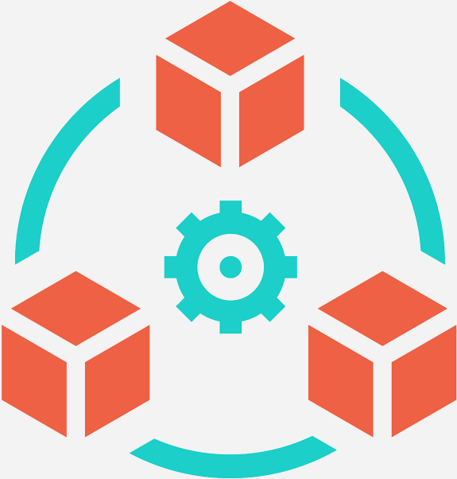

## Welcome to The RADIANT Systems Lab!

The Radiant Systems Lab directed by <a href="https://engineering.missouri.edu/faculty/tanu-malik/">Dr. Tanu Malik</a> is located in the <a href="https://engineering.missouri.edu/departments/eecs/">Department of Electrical Engineering and Computer Science</a> at the <a href="http://www.missouri.edu">University of Missouri-Columbia (Mizzou)</a>. This lab is a front runner in the design of reproducible, accountable, and trustworthy data-driven systems and infrastructure. This lab aims to advance reproducible, accountable, explainable, and policy-aware data science by developing systems that enhance the reliability of data-intensive, distributed, and parallel scientific workflows through accountable and reproducible containerization. It also focuses on improving transparency in artificial intelligence by making data, algorithms, and decision-making processes within scientific workflows more interpretable and understandable.

  

  

    

      
      
      
      
    

    <button class="nav-btn prev-btn" onclick="moveSlide(-1)">&#10094;</button>
    <button class="nav-btn next-btn" onclick="moveSlide(1)">&#10095;</button>

    

      

      

      

      

    

  

  

The focus of the research performed in this lab includes but is not limited to:

- **Reproducible and Accountable Systems (RAS):**  
  Improving data-intensive, distributed, and parallel science workflows with reproducible and accountable containers.

- **Transparent and Explainable AI (XAI):**  
  Make data, algorithms, and decision-making processes in science workflows explainable and understandable.

- **Infrastructure and Policy (INP):**  
  Engage in resource and systems optimization of infrastructure, guided by policy frameworks.

The history of the RADIANT Systems Lab traces back to the DICE (Data, Infrastructure, Computation, and Environments) Lab at <a href="https://www.depaul.edu/Pages/default.aspx">DePaul University</a>, which focused on foundational research in data provenance, computational reproducibility, and optimization within complex systems and virtual environments.  Today, the RADIANT Systems Lab continues this tradition and actively collaborates with researchers and scientists worldwide to advance the frontiers of reproducible and data-driven computing.
