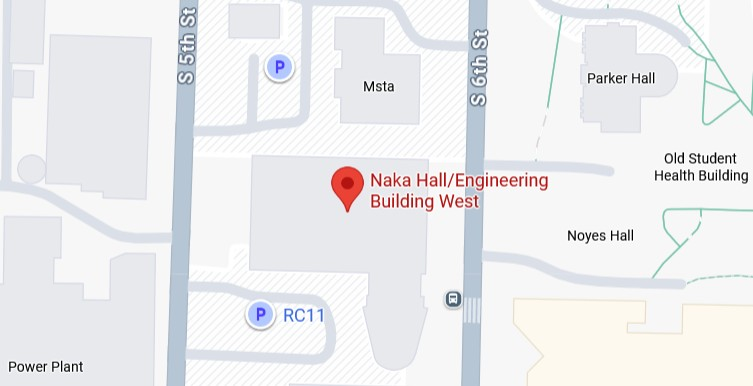

  

    <h2><i class="fa-solid fa-circle-info"></i> About the Lab</h2>
    

      <a href="#about_history">History</a>
      <a href="#stats-section">Stats</a>
      <a href="#work-section">Join Us</a>
      <a href="#contact-section">Contact</a>
    

  

  <section class="history-section" id="about_history">
    <h2 class="history-title"><i class="fa-solid fa-clock-rotate-left"></i> History</h2>
    

      

        
      

      

        

          The RADIANT Systems Lab traces its origins to the Data, Infrastructure, Computation, and Environments (DICE) Lab at
          <a href="https://dice.cs.depaul.edu">DePaul University</a>. Building on this legacy, the RADIANT Systems Lab continues
          to push the frontiers of reproducible and data-driven computing, actively collaborating with researchers and scientists worldwide.
        

      

    

  </section>

  <section class="stats-section" id="stats-section">
    <h2 class="stats-title"><i class="fa-solid fa-chart-line"></i> Lab Stats</h2>
    

      

        <i class="fa-solid fa-book-open stat-icon" aria-hidden="true"></i>
        77
        
Publications

      

      

        <i class="fa-solid fa-people-group stat-icon" aria-hidden="true"></i>
        22
        
Team Members

      

      

        <i class="fa-solid fa-award stat-icon" aria-hidden="true"></i>
        12+
        
Years of Excellence

      

      

        <i class="fa-solid fa-handshake-angle stat-icon" aria-hidden="true"></i>
        10+
        
Collaborations

      

    

  </section>

  <section class="work-section" id="work-section">
    <h2 class="work-title"><i class="fa-solid fa-briefcase"></i> Work at Mizzou</h2>
    

      Interested in joining Radiant Lab? We offer opportunities for graduate students, postdoctoral researchers, and visiting scholars to contribute to groundbreaking projects.
    

    <a href="https://radiant-systems-lab.github.io/people.html#openings" class="work-button">
      <i class="fa-solid fa-arrow-up-right-from-square"></i> Explore Open Positions
    </a>
  </section>

  <section class="contact-section" id="contact-section">
    <h2 class="contact-title"><i class="fa-solid fa-address-card"></i> Contact Us</h2>
    

      

        

          <i class="fa-regular fa-envelope"></i>
          Email:
          <a href="mailto:tanu@missouri.edu">tanu@missouri.edu</a>
        

        

          <i class="fa-solid fa-phone"></i>
          Phone:
          <a href="tel:+15738849203">+1 (573) 884-9203</a>
        

        

          <i class="fa-solid fa-location-dot"></i>
          Address:
          416, S 6th St., Naka 311, Columbia, MO 65211
        

      

      

        
      

    

  </section>

