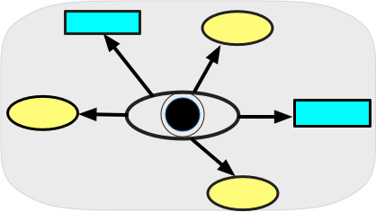
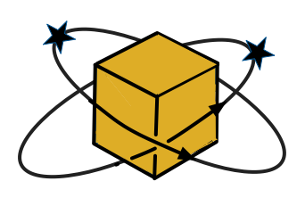
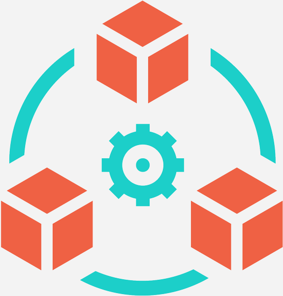
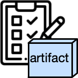

## Welcome to The RADIANT Systems Lab!

The Radiant Systems Lab directed by <a href="https://engineering.missouri.edu/faculty/tanu-malik/">Dr. Tanu Malik</a> is located in the <a href="https://engineering.missouri.edu/departments/eecs/">Department of Electrical Engineering and Computer Science</a> at the <a href="http://www.missouri.edu">University of Missouri-Columbia (Mizzou)</a>. This lab is a front runner in the design of reproducible, accountable, and trustworthy data-driven systems and infrastructure. This lab aims to advance reproducible, accountable, explainable, and policy-aware data science by developing systems that enhance the reliability of data-intensive, distributed, and parallel scientific workflows through accountable and reproducible containerization. It also focuses on improving transparency in artificial intelligence by making data, algorithms, and decision-making processes within scientific workflows more interpretable and understandable.  
<!-- 
 -->
  
  <!-- 

    

      
      
      
      
      
    

  
 -->
  

  <!-- History Section -->
  <section class="history-section" id="about_history">
    

      <h2 class="history-title">
        History
      </h2>
    

    

      

        

          

            
            
            
          

          

            <button onclick="prevSlide()">‹</button>
            <button onclick="nextSlide()">›</button>
          

          

            
            
            
          

        

      

      

        

          The history of the RADIANT Systems Lab traces back to the Data, Infrastructure, Computation, and Environments (DICE) Lab at <a href="https://www.depaul.edu/Pages/default.aspx">DePaul University</a>, which focused on foundational research in data provenance, computational reproducibility, and optimization within complex systems and virtual environments.  Today, the RADIANT Systems Lab continues this tradition and actively collaborates with researchers and scientists worldwide to advance the frontiers of reproducible and data-driven computing.
        

      

    

  </section>
  
  <section class="stats-section">
    <h2 class="stats-title">
      Stats
    </h2>
    

      

        50+
        
Publications

      

      

        20
        
Team Members

      

      

        10
        
Years of Excellence

      

      

        5
        
Departments Collaborated

      

    

  </section>
  <section class="work-section">
    <h2 class="work-title">
      Work at Mizzou
    </h2>
    

      Interested in joining Radiant Lab? We offer opportunities for graduate students, postdoctoral researchers, and visiting scholars to contribute to groundbreaking projects. At Mizzou, you’ll collaborate with experts, access state-of-the-art facilities, and impact real-world innovations.
    

    <a href="mailto:join@radiantlab.edu" class="work-button">
      Join Our Team
    </a>
  </section>

  <section class="contact-section">
    <h2 class="contact-title">
      Contact Us
    </h2>
    

      

        

          Email:
          <a href="mailto:contact@radiantlab.edu" class="contact-link">
            contact@radiantlab.edu
          </a>
        

        

          Phone:
          <a href="tel:+1234567890" class="contact-link">
            +1 (234) 567-890
          </a>
        

        

          Address: University of Missouri - Columbia, Naka Hall, MO 65201
        

      

      

        <!-- Swap in your actual map image path -->
        
      

    

  </section>

